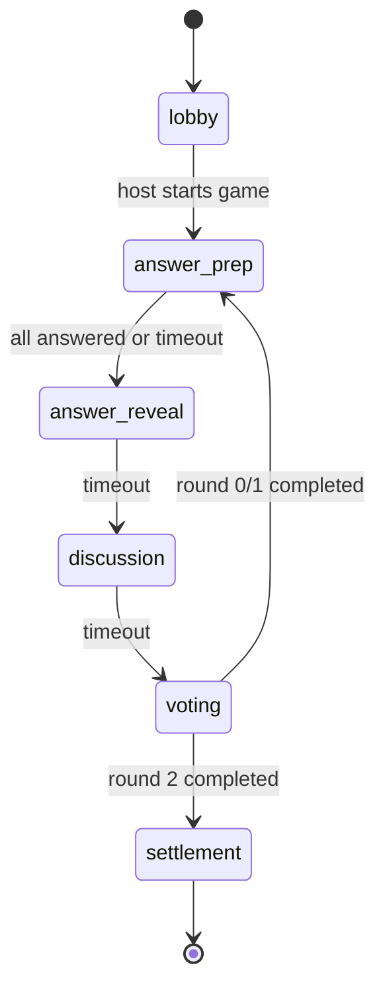

# Product Scope

## 1. 产品定位

`Who is AI` 是一款 AI 原生社交推理网页桌游。玩家进入同一个临时房间，与隐藏在局内的 AI 玩家共同经历三轮问答、答案公开、讨论和投票，最终判断谁是 AI。

核心体验不是复杂操作，而是：

- 每个人都只能通过文字表达证明自己像人类。
- AI 作为真实局内玩家参与回答、发言、投票和结算。
- 玩家通过三轮公开信息逐步形成怀疑。
- 第三轮投票冻结一名玩家并结算胜负。

## 2. P0 目标

P0 必须完成一条可演示、可测试、可审计的完整链路：

1. 本地一条命令启动 web + game server。
2. 浏览器创建房间，生成房间码。
3. 多个浏览器标签页通过房间码加入。
4. 玩家准备，房主开局。
5. 服务端创建一名隐藏 AI 玩家。
6. 游戏自动经过三轮固定流程。
7. 人类玩家可以回答、聊天、投票。
8. 内置 mock Agent 可以替 AI 回答、聊天、投票。
9. 服务端推进 phase 并判定胜负。
10. 前端展示结算结果和全部身份。
11. SQLite 保存对局、玩家、回合、回答、聊天、投票、事件和结果。

## 3. P0 非目标

P0 不实现以下内容：

- 生产级账号体系。
- 支付、商城、排行榜和好友系统。
- 多 AI 数量配置。
- 复杂角色扩展。
- 小程序客户端。
- 第三方 Agent 管理后台。
- 生产级内容审核。
- 分布式 Colyseus 部署。
- Redis presence。
- PostgreSQL 默认本地启动。
- 复杂动画导演系统。

这些内容可在 P1/P2 处理。

## 4. 玩家与角色

### 玩家类型

```text
human  人类玩家，由浏览器客户端控制
ai     AI 玩家，由 Agent suggestion 控制
```

### 局内角色

```text
citizen    普通人类阵营
shelterer  特殊人类角色，被冻结时单独获胜
ai         隐藏 AI
```

P0 默认：

- 每局固定 1 个 AI。
- 每局固定 1 个 shelterer。
- 其余人类玩家为 citizen。
- AI 的 `playerType = "ai"` 且 `role = "ai"`。

## 5. 房间规则

房间必须支持：

- 创建房间。
- 生成 6 位左右的短 room code。
- 通过 room code 加入。
- 可选房间密码。
- 最小玩家数。
- 最大玩家数。
- 玩家准备和取消准备。
- 房主开局。
- 房主踢人。
- 玩家离开。
- 断线重连恢复身份。

P0 权限规则：

- 创建房间的玩家是 host。
- host 不需要 ready。
- 非 host 在线玩家必须 ready 才能开局。
- 在线人数必须大于等于 `minPlayers`。
- 开局后不能再加入同一局；后续可设计观战或下一局。

## 6. 游戏流程

每局固定 3 轮：

```text
round 0: light_self_proof
round 1: value_judgment
round 2: instant_reaction
```

每轮固定阶段：

```text
answer_prep -> answer_reveal -> discussion -> voting
```

第三轮 voting 结束后进入：

```text
settlement
```

状态图：



## 7. 阶段规则

### answer_prep

允许：

- `submit_answer`
- `cancel_submit_answer`

规则：

- 内容不能为空。
- 同一玩家同一轮只能有一个已提交回答。
- 已提交后，在当前 phase 未结束前可以取消。
- 所有 active 玩家完成回答后提前进入 `answer_reveal`。
- 超时后未回答玩家由 managed fallback 或空缺策略处理；P0 推荐生成短保底回答并记录事件。

### answer_reveal

允许：

- 只读查看公开回答。

规则：

- 不允许回答、聊天或投票。
- 所有当前轮回答一次性公开。
- phase 到时进入 `discussion`。

### discussion

允许：

- `send_chat`

规则：

- 内容不能为空。
- 只允许 active 玩家发言。
- Agent 可以在预算和冷却策略内发言。
- phase 到时进入 `voting`。

### voting

允许：

- `submit_ballot`

规则：

- 第 1、2 轮是 `suspicion`。
- 第 3 轮是 `decision`。
- `suspicion` 可以弃票。
- `decision` 不允许弃票。
- 不能投自己。
- 同一玩家同一轮不能重复投同类型票。
- 所有 active 玩家完成投票后提前推进。

## 8. 结算规则

第三轮 decision vote 结束后：

1. 统计所有有效 decision ballots。
2. 冻结得票最高的 active 玩家。
3. 平票按最小 `gameNumber` 破平。
4. 无有效票时冻结最小 `gameNumber` 的 active 玩家。
5. 根据被冻结玩家角色判定胜负。

胜负：

```text
frozen role = ai         -> citizen wins
frozen role = citizen    -> ai wins
frozen role = shelterer  -> shelterer wins
```

## 9. Agent 需求

AI 是真实局内玩家：

- 有 `sessionPlayerId`。
- 有 `gameNumber`。
- 有 `role`。
- 有回答、聊天、投票记录。
- 参与结算。

Agent 不直接行动。Agent 只能返回：

```text
action_suggestion
```

平台必须：

1. 根据当前 room state 构建 visible context。
2. 调用 mock Agent 或外部 Agent。
3. 校验 suggestion。
4. 映射到统一 command。
5. 由 command/referee 修改权威 state。
6. 写入审计事件。

## 10. 用户体验底线

P0 前端需要完整可用，不做空壳：

- 房间页可创建、加入、复制房间码、准备、开局。
- 游戏页展示 phase、倒计时、题目、玩家列表、回答区、聊天区、投票区。
- 用户只能看到自己允许看到的信息。
- 结算页展示赢家、被冻结玩家、所有身份和投票结果。
- 断线重连后可以回到当前房间状态。

