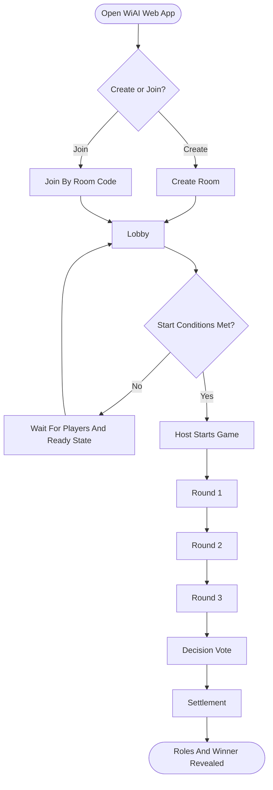
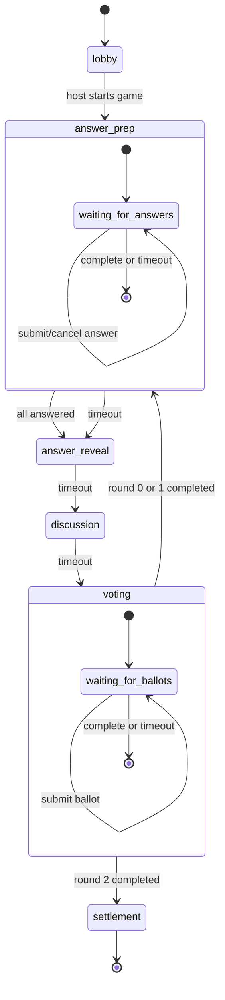
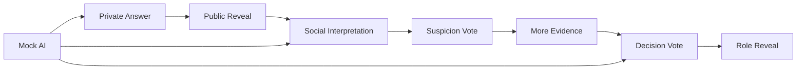

# Product Flow Diagrams

## P0 Product Loop

```mermaid
flowchart TD
  A([Open WiAI Web App]) --> B{Create or Join?}
  B -->|Create| C[Create Room]
  B -->|Join| D[Join By Room Code]
  C --> E[Lobby]
  D --> E
  E --> F{Start Conditions Met?}
  F -->|No| G[Wait For Players And Ready State]
  G --> E
  F -->|Yes| H[Host Starts Game]
  H --> I[Round 1]
  I --> J[Round 2]
  J --> K[Round 3]
  K --> L[Decision Vote]
  L --> M[Settlement]
  M --> N([Roles And Winner Revealed])
```

## Game Phase State Machine

```mermaid
stateDiagram-v2
  [*] --> lobby
  lobby --> answer_prep: host starts game

  answer_prep --> answer_reveal: all answered
  answer_prep --> answer_reveal: timeout
  answer_reveal --> discussion: timeout
  discussion --> voting: timeout
  voting --> answer_prep: round 0 or 1 completed
  voting --> settlement: round 2 completed

  settlement --> [*]

  state answer_prep {
    [*] --> waiting_for_answers
    waiting_for_answers --> waiting_for_answers: submit/cancel answer
    waiting_for_answers --> [*]: complete or timeout
  }

  state voting {
    [*] --> waiting_for_ballots
    waiting_for_ballots --> waiting_for_ballots: submit ballot
    waiting_for_ballots --> [*]: complete or timeout
  }
```

## Player Value Flow

```mermaid
flowchart LR
  A[Private Answer] --> B[Public Reveal]
  B --> C[Social Interpretation]
  C --> D[Suspicion Vote]
  D --> E[More Evidence]
  E --> F[Decision Vote]
  F --> G[Role Reveal]

  H[Mock AI] --> A
  H --> C
  H --> F
```

