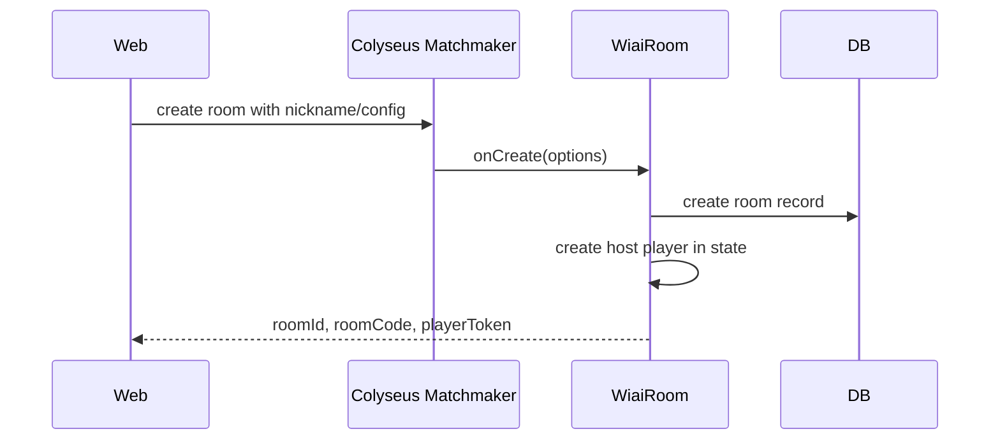
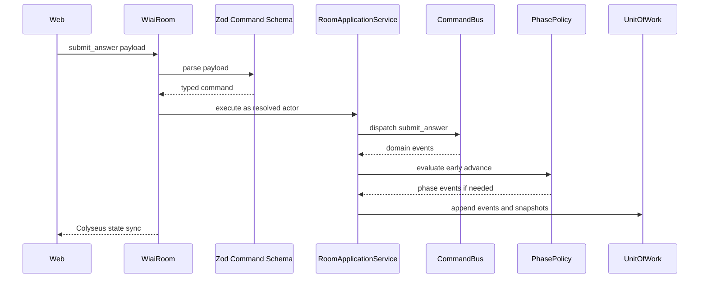
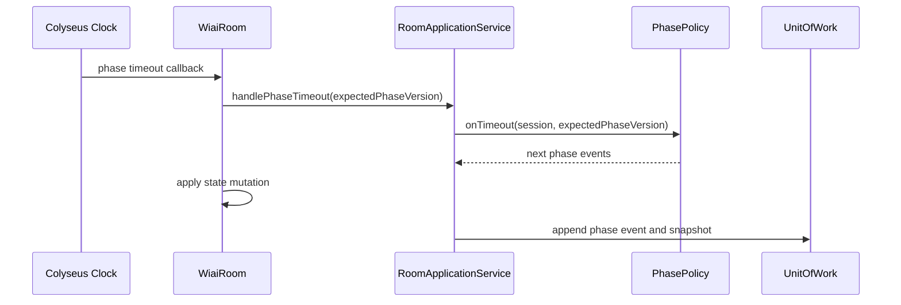

# System Architecture

## 1. 架构总览

P0 是一个 TypeScript monorepo：

```text
apps/web       React + Next.js App Router browser app
apps/server    Node.js + Colyseus authoritative game server and application services
packages/kernel Shared ids, value objects, Result, stable enum values
packages/game  Pure game aggregate, command handlers, phase policies
packages/schema Zod protocol schemas and DTO mappers
packages/db    Drizzle schema, migrations, repositories, Unit of Work
packages/agent AgentProvider strategies and mock agent
packages/content Questions, rules copy, story copy
tests/e2e      Playwright multi-tab smoke tests
```

进程模型：

```text
npm run dev
  -> starts apps/server
  -> starts apps/web
```

P0 不启动 Redis、PostgreSQL、Django、Python worker 或独立裁判进程。

## 2. 技术栈职责

| 技术 | 职责 |
|---|---|
| React | 前端 UI 组件和交互 |
| Next.js App Router | 前端路由、页面组织、Server Components、Vercel 部署 |
| shadcn/ui | 高质量 React UI 组件源码 |
| Tailwind CSS | 设计 token、布局、普通交互动效 |
| GSAP | 阶段切换、揭晓、投票和结算演出动画 |
| Node.js | 服务端运行时 |
| Colyseus | 房间、连接、重连、clock、live state sync |
| Colyseus Schema | 同步 live room state |
| Zod | 命令、HTTP、Agent 协议校验 |
| Drizzle | 数据库 schema、migration、repository |
| SQLite | P0 本地零依赖持久化 |
| PostgreSQL | 生产数据库 |
| Vitest | 单元和集成测试 |
| Playwright | 多标签端到端测试 |

## 3. 状态真相源

P0 采用双层真相源：

```text
active room truth   = Colyseus Room state
durable truth       = database event log + snapshots + result
```

含义：

- 游戏进行中，Colyseus state 是实时权威状态。
- 前端只订阅 Colyseus state，不自行推导权威状态。
- 每个有效 command 写入 event log。
- phase 切换和 settlement 写入 snapshot/result。
- 服务重启恢复属于 P1；P0 先保证持久化结构可支持恢复。

## 4. 裁判位置

裁判运行在 `apps/server` 进程内，但规则代码位于 `packages/game`。

```text
apps/server/src/rooms/WiaiRoom.ts
  - Colyseus Room adapter
  - onCreate/onJoin/onLeave/onMessage
  - room clock timer
  - delegates to RoomApplicationService

apps/server/src/application/RoomApplicationService.ts
  - resolves actor from connection
  - calls schema adapters and command bus
  - owns persistence Unit of Work boundary
  - schedules AgentProvider turns

packages/game/src/commands/
  - one command handler per command family
  - validate command against current aggregate state
  - return domain events

packages/game/src/policies/
  - phase policies
  - settlement policy
  - role assignment strategy
  - visibility policy
```

一句话：

```text
Colyseus Room 是裁判的身体和计时器。
packages/game 是裁判的大脑。
```

## 5. 服务端流程

### 创建房间



### 提交命令



### Phase 超时



## 6. 模块边界

### `packages/game`

只能依赖 TypeScript 标准能力和 `packages/kernel` 中的共享值对象和稳定枚举。不得依赖：

- React
- Colyseus
- Drizzle
- Zod
- packages/schema
- packages/db
- packages/agent
- Node HTTP framework
- browser API

Audit update: `packages/game` depends on `packages/kernel`, not `packages/schema`. Protocol validation belongs to `packages/schema` and server application adapters.

这样才能让裁判和规则被 Vitest 直接测试。

### `apps/server`

可以依赖：

- Colyseus
- `packages/game`
- `packages/kernel`
- `packages/schema`
- `packages/db`
- `packages/agent`

职责是把网络、房间、计时器、持久化和 Agent 调度接起来。

### `packages/schema`

存放外部协议：

- client command schema
- server error schema
- Agent visible context schema
- Agent suggestion schema
- HTTP admin payload schema

不要把 Colyseus Schema class 放在这里。Colyseus live state class 放在 `apps/server/src/state` 或 `packages/game-state-colyseus`，P0 推荐放在 `apps/server/src/state`，减少抽象。

### `packages/db`

存放：

- Drizzle tables
- migrations
- database client factory
- repositories

Repository 接收纯数据对象，不接收 Colyseus `Schema` 实例。

### `packages/agent`

存放：

- mock Agent
- suggestion validator
- visible context builder helper
- external Agent protocol helpers

Agent 不依赖 React，不直接依赖 Colyseus Room。

## 7. 前端架构

前端以可用游戏屏幕为第一目标，不做营销首页。

建议目录：

```text
apps/web/src/
  app/
    layout.tsx
    page.tsx
    room/[roomCode]/page.tsx
    game/[roomId]/page.tsx
  components/
    ui/
    lobby/
    game/
    shell/
  game-client/
    colyseusClient.ts
    useRoomConnection.ts
    roomCommands.ts
  animations/
    phaseTransitions.ts
    revealTimeline.ts
  styles/
    globals.css
```

状态策略：

- Colyseus state 是 live game source。
- React state 管 UI 草稿。
- 不在 P0 引入 Redux/Zustand。
- 不在 P0 引入 TanStack Query。

Next.js component policy:

- Keep `layout.tsx`, static rules pages, replay lists, and future admin list pages as Server Components when possible.
- Put live room connection code behind `'use client'` components.
- Colyseus client, `window`, `localStorage`, countdown effects, and GSAP must never run in Server Components.
- Do not initialize database clients or service SDKs at module scope inside Next.js routes; use lazy getters if Next web code later needs server-side data access.

## 8. 动画架构

动画由前端消费事件和状态差异：

```text
phase changed -> GSAP phase transition
answers revealed -> GSAP reveal sequence
vote result visible -> GSAP vote tally
settlement entered -> GSAP identity reveal
```

禁止：

- 动画回调推进 phase。
- 动画回调提交投票。
- 客户端根据动画结束时间计算权威状态。

服务端状态永远先发生，动画只是表现。

## 9. 部署路径

P0 local：

```text
single Node process for Colyseus server
Next.js dev server for web
SQLite file
```

P1 preview：

```text
Vercel hosts Next.js web app
long-running Node host runs Colyseus
SQLite or managed PostgreSQL depending on preview needs
```

Production：

```text
Vercel or static host for web
Fly.io/Render/Railway/VPS/Kubernetes for Colyseus server
PostgreSQL for database
Redis presence only when multiple Colyseus processes are required
```

Vercel Functions 不承载 Colyseus WebSocket server。
