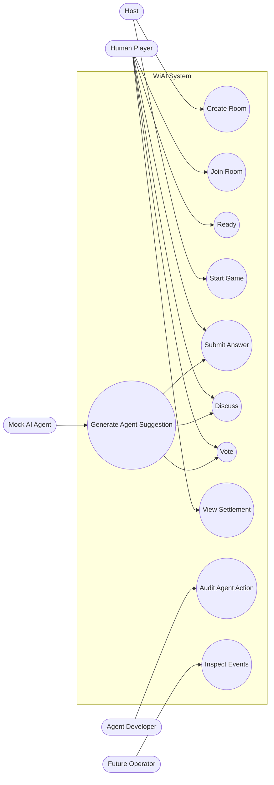
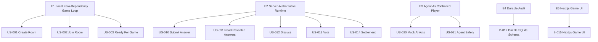

# Use Case Diagram

Mermaid does not have native UML use-case syntax, so this uses a flowchart with actor and use-case nodes.

```mermaid
flowchart LR
  Host([Host])
  Player([Human Player])
  AgentDev([Agent Developer])
  Operator([Future Operator])
  MockAI([Mock AI Agent])

  subgraph WiAI["WiAI System"]
    UC1((Create Room))
    UC2((Join Room))
    UC3((Ready))
    UC4((Start Game))
    UC5((Submit Answer))
    UC6((Discuss))
    UC7((Vote))
    UC8((View Settlement))
    UC9((Generate Agent Suggestion))
    UC10((Audit Agent Action))
    UC11((Inspect Events))
  end

  Host --> UC1
  Host --> UC4
  Player --> UC2
  Player --> UC3
  Player --> UC5
  Player --> UC6
  Player --> UC7
  Player --> UC8
  MockAI --> UC9
  UC9 --> UC5
  UC9 --> UC6
  UC9 --> UC7
  AgentDev --> UC10
  Operator --> UC11
```

## Story-To-System Trace

```mermaid
flowchart TD
  E1[E1 Local Zero-Dependency Game Loop] --> US001[US-001 Create Room]
  E1 --> US002[US-002 Join Room]
  E1 --> US003[US-003 Ready For Game]

  E2[E2 Server-Authoritative Runtime] --> US010[US-010 Submit Answer]
  E2 --> US011[US-011 Read Revealed Answers]
  E2 --> US012[US-012 Discuss]
  E2 --> US013[US-013 Vote]
  E2 --> US014[US-014 Settlement]

  E3[E3 Agent As Controlled Player] --> US020[US-020 Mock AI Acts]
  E3 --> US021[US-021 Agent Safety]

  E4[E4 Durable Audit] --> B012[B-012 Drizzle SQLite Schema]
  E5[E5 Next.js Game UI] --> B015[B-015 Next.js Game UI]
```

