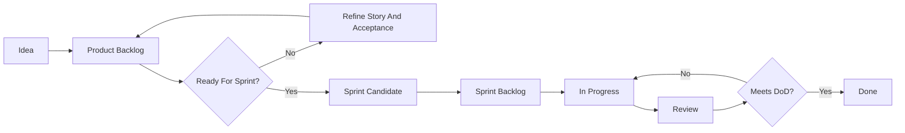
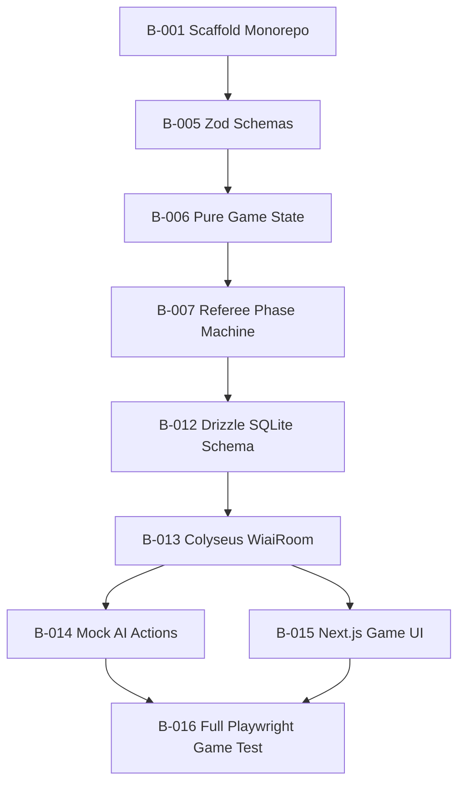
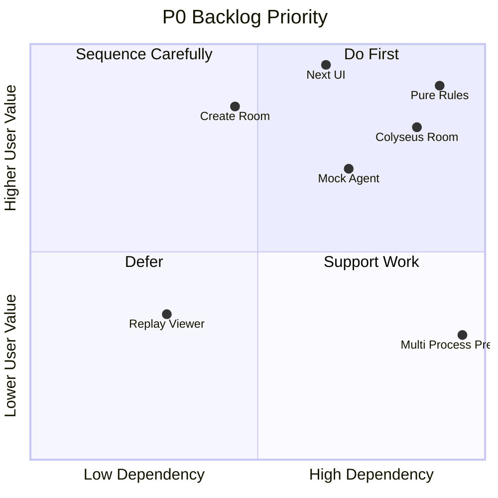

# Backlog Flow Diagrams

## Backlog Item Lifecycle

```mermaid
flowchart LR
  A[Idea] --> B[Product Backlog]
  B --> C{Ready For Sprint?}
  C -->|No| D[Refine Story And Acceptance]
  D --> B
  C -->|Yes| E[Sprint Candidate]
  E --> F[Sprint Backlog]
  F --> G[In Progress]
  G --> H[Review]
  H --> I{Meets DoD?}
  I -->|No| G
  I -->|Yes| J[Done]
```

## P0 Dependency Order

```mermaid
flowchart TD
  B001[B-001 Scaffold Monorepo] --> B005[B-005 Zod Schemas]
  B005 --> B006[B-006 Pure Game State]
  B006 --> B007[B-007 Referee Phase Machine]
  B007 --> B012[B-012 Drizzle SQLite Schema]
  B012 --> B013[B-013 Colyseus WiaiRoom]
  B013 --> B014[B-014 Mock AI Actions]
  B013 --> B015[B-015 Next.js Game UI]
  B014 --> B016[B-016 Full Playwright Game Test]
  B015 --> B016
```

## Priority Quadrant

```mermaid
quadrantChart
  title P0 Backlog Priority
  x-axis Low Dependency --> High Dependency
  y-axis Lower User Value --> Higher User Value
  quadrant-1 Do First
  quadrant-2 Sequence Carefully
  quadrant-3 Defer
  quadrant-4 Support Work
  Create Room: [0.45, 0.85]
  Pure Rules: [0.90, 0.90]
  Colyseus Room: [0.85, 0.80]
  Mock Agent: [0.70, 0.70]
  Next UI: [0.65, 0.95]
  Replay Viewer: [0.30, 0.35]
  Multi Process Presence: [0.95, 0.30]
```

