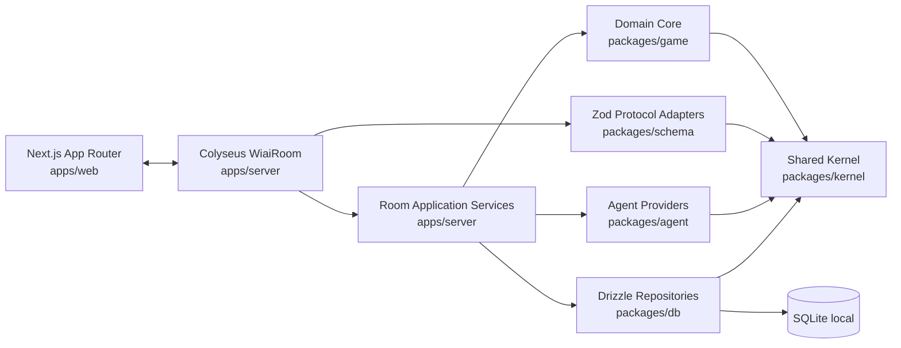

# Architecture Overview

## System Shape

WiAI is a TypeScript monorepo with a clean split between presentation, realtime runtime, application services, pure domain rules, protocol validation, persistence, and Agent providers.



## Authority Model

- Browser sends commands.
- Schema adapters validate command DTOs.
- Application services resolve the actor from the connection.
- Command handlers mutate the domain aggregate.
- Phase policies advance phase and settlement policies resolve outcome.
- Colyseus syncs live state.
- Drizzle persists durable records through repositories and Unit of Work.

## Process Model

P0 local:

```text
Next.js dev server
Colyseus Node server
SQLite file
```

The root `npm run dev` starts both app processes.

## Main Boundaries

| Boundary | Rule |
|---|---|
| React to server | Commands only, no authoritative state mutation |
| WiaiRoom to application | Adapts Colyseus messages to application service calls |
| Application to game | Dispatches domain command intents through command handlers |
| Game to DB | No direct dependency |
| Game to schema | No direct dependency |
| Agent to game | No direct dependency; Agent receives visible context only |
| DB to Colyseus | Plain objects only, no Schema instance persistence |

## Architectural Style

The rewrite uses a lightweight Clean Architecture / Hexagonal style:

```text
Adapters -> Application Services -> Domain Core -> Shared Kernel
```

- `apps/web`, Colyseus room handlers, Zod schemas, Drizzle repositories, and Agent providers are adapters.
- `apps/server` owns application services because it composes realtime runtime, persistence, and Agent scheduling.
- `packages/game` owns domain behavior and must remain independently testable with Vitest.
- `packages/kernel` owns stable primitives only. It must not become a utility dumping ground.
