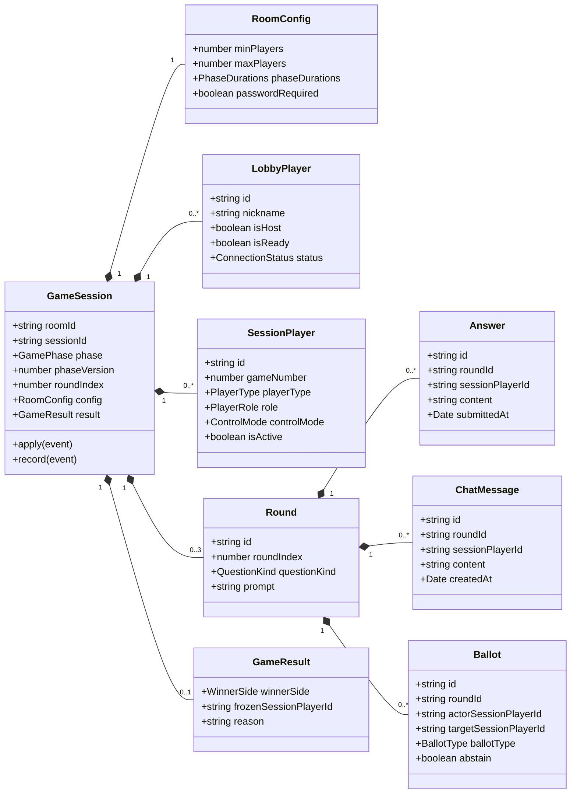
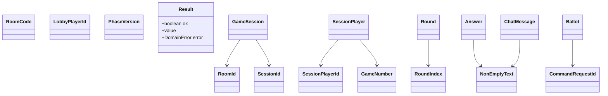
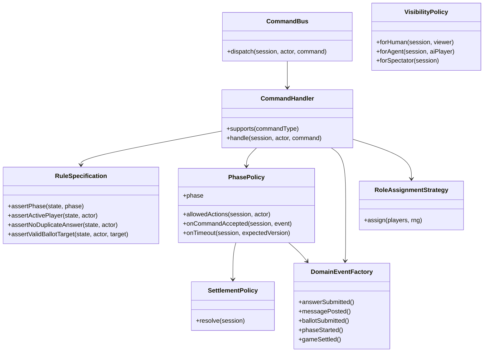
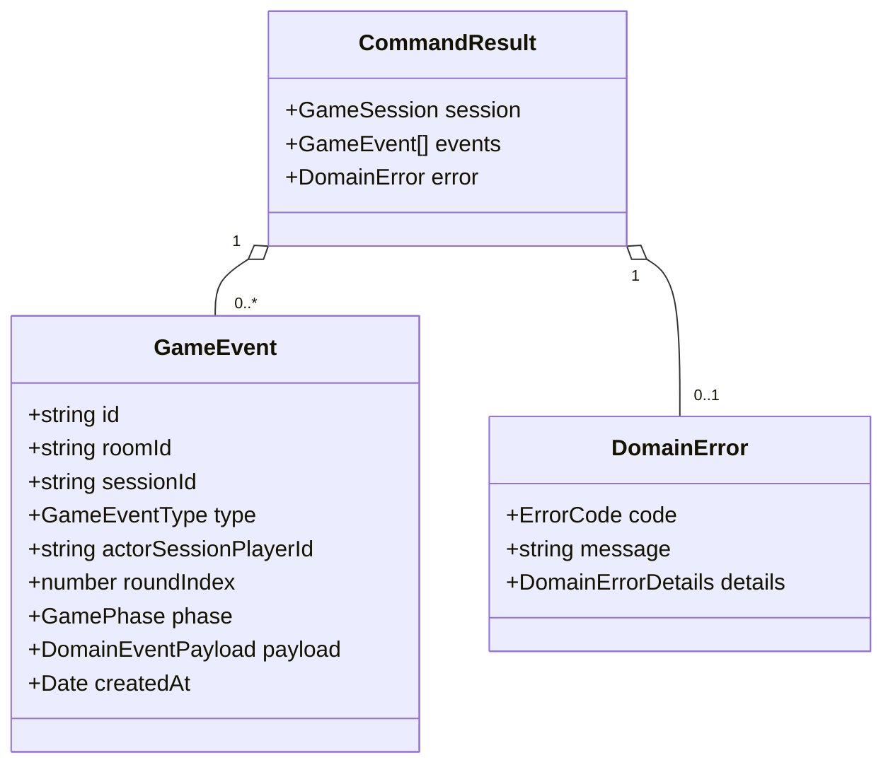

# Domain Model Diagrams

## Pure Domain Aggregate Model

This diagram describes `@wiai/game` domain objects. These are not Colyseus Schema classes, Zod DTOs, or Drizzle table classes.

## Value Objects And Shared Kernel

`@wiai/kernel` exists to prevent primitive obsession without making the domain depend on protocol or database code.

## Command Pattern And Domain Policies

## Domain Event Model

