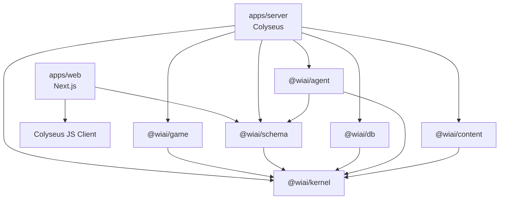
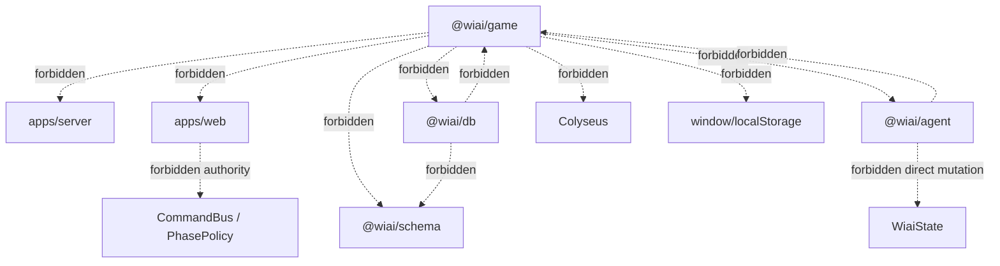
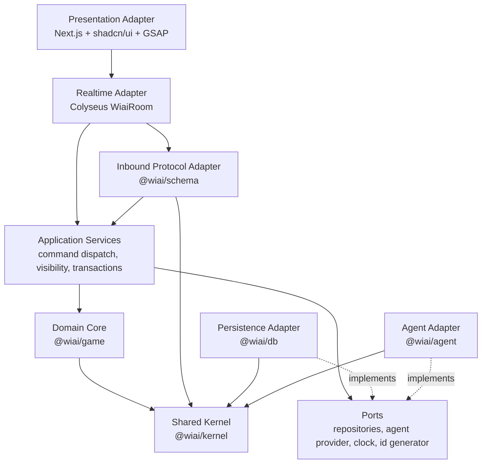

# Package Dependency Diagrams

## Allowed Dependency Direction

```mermaid
flowchart TD
  Web["apps/web\nNext.js"] --> Schema["@wiai/schema"]
  Web --> Client["Colyseus JS Client"]

  Server["apps/server\nColyseus"] --> Schema
  Server --> Game["@wiai/game"]
  Server --> DB["@wiai/db"]
  Server --> Agent["@wiai/agent"]
  Server --> Content["@wiai/content"]
  Server --> Kernel["@wiai/kernel"]

  Game --> Kernel
  Schema --> Kernel
  DB --> Kernel
  Agent --> Kernel
  Agent --> Schema

  Content --> Kernel
```

## Forbidden Dependency Direction

```mermaid
flowchart TD
  Game["@wiai/game"] -. forbidden .-> Server["apps/server"]
  Game -. forbidden .-> Web["apps/web"]
  Game -. forbidden .-> DB["@wiai/db"]
  Game -. forbidden .-> Schema["@wiai/schema"]
  Game -. forbidden .-> Agent["@wiai/agent"]
  Game -. forbidden .-> Colyseus["Colyseus"]
  Game -. forbidden .-> Browser["window/localStorage"]

  DB["@wiai/db"] -. forbidden .-> Schema
  DB -. forbidden .-> Game

  Agent["@wiai/agent"] -. forbidden direct mutation .-> WiaiState["WiaiState"]
  Agent -. forbidden .-> Game
  Web -. forbidden authority .-> DomainPolicy["CommandBus / PhasePolicy"]
```

## Implementation Layering

```mermaid
flowchart TB
  UI["Presentation Adapter\nNext.js + shadcn/ui + GSAP"]
  Realtime["Realtime Adapter\nColyseus WiaiRoom"]
  Protocol["Inbound Protocol Adapter\n@wiai/schema"]
  Application["Application Services\ncommand dispatch, visibility, transactions"]
  Domain["Domain Core\n@wiai/game"]
  Kernel["Shared Kernel\n@wiai/kernel"]
  Ports["Ports\nrepositories, agent provider, clock, id generator"]
  Persistence["Persistence Adapter\n@wiai/db"]
  Agent["Agent Adapter\n@wiai/agent"]

  UI --> Realtime
  Realtime --> Protocol
  Realtime --> Application
  Protocol --> Application
  Application --> Domain
  Application --> Ports
  Domain --> Kernel
  Protocol --> Kernel
  Persistence --> Kernel
  Agent --> Kernel
  Persistence -. implements .-> Ports
  Agent -. implements .-> Ports
```
