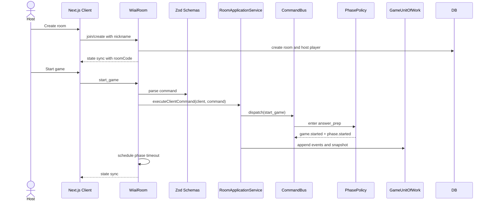
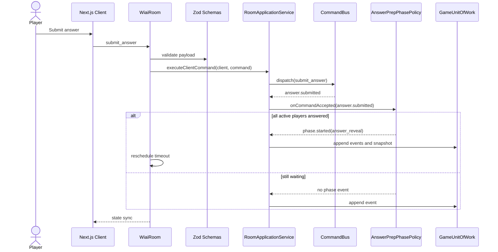
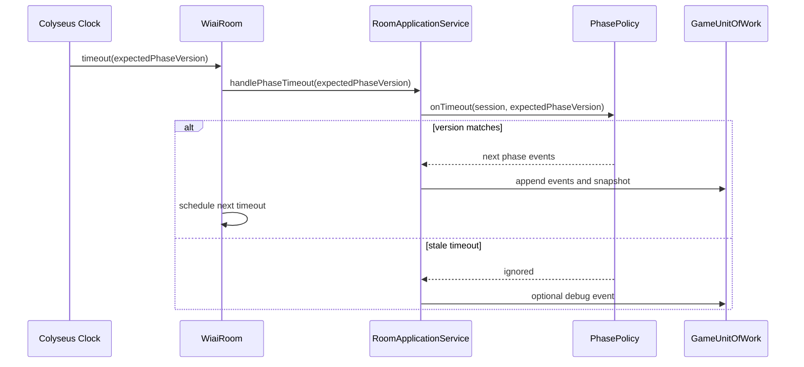
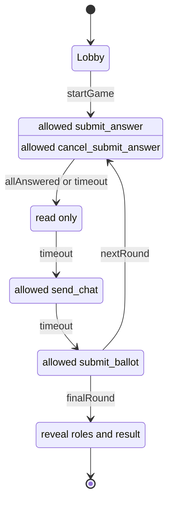

# Runtime Sequence Diagrams

## Create And Start Game

```mermaid
sequenceDiagram
  actor Host
  participant Web as Next.js Client
  participant Room as WiaiRoom
  participant Schema as Zod Schemas
  participant App as RoomApplicationService
  participant Bus as CommandBus
  participant Phase as PhasePolicy
  participant Uow as GameUnitOfWork

  Host->>Web: Create room
  Web->>Room: join/create with nickname
  Room->>DB: create room and host player
  Room-->>Web: state sync with roomCode

  Host->>Web: Start game
  Web->>Room: start_game
  Room->>Schema: parse command
  Room->>App: executeClientCommand(client, command)
  App->>Bus: dispatch(start_game)
  Bus->>Phase: enter answer_prep
  Phase-->>Bus: game.started + phase.started
  App->>Uow: append events and snapshot
  Room->>Room: schedule phase timeout
  Room-->>Web: state sync
```

## Submit Answer With Early Advance

```mermaid
sequenceDiagram
  actor Player
  participant Web as Next.js Client
  participant Room as WiaiRoom
  participant Schema as Zod Schemas
  participant App as RoomApplicationService
  participant Bus as CommandBus
  participant Phase as AnswerPrepPhasePolicy
  participant Uow as GameUnitOfWork

  Player->>Web: Submit answer
  Web->>Room: submit_answer
  Room->>Schema: validate payload
  Room->>App: executeClientCommand(client, command)
  App->>Bus: dispatch(submit_answer)
  Bus-->>App: answer.submitted
  App->>Phase: onCommandAccepted(answer.submitted)
  alt all active players answered
    Phase-->>App: phase.started(answer_reveal)
    App->>Uow: append events and snapshot
    Room->>Room: reschedule timeout
  else still waiting
    Phase-->>App: no phase event
    App->>Uow: append event
  end
  Room-->>Web: state sync
```

## Phase Timeout With Stale Guard

```mermaid
sequenceDiagram
  participant Clock as Colyseus Clock
  participant Room as WiaiRoom
  participant App as RoomApplicationService
  participant Phase as PhasePolicy
  participant Uow as GameUnitOfWork

  Clock->>Room: timeout(expectedPhaseVersion)
  Room->>App: handlePhaseTimeout(expectedPhaseVersion)
  App->>Phase: onTimeout(session, expectedPhaseVersion)
  alt version matches
    Phase-->>App: next phase events
    App->>Uow: append events and snapshot
    Room->>Room: schedule next timeout
  else stale timeout
    Phase-->>App: ignored
    App->>Uow: optional debug event
  end
```

## Referee State Machine

```mermaid
stateDiagram-v2
  [*] --> Lobby
  Lobby --> AnswerPrep: startGame
  AnswerPrep --> AnswerReveal: allAnswered or timeout
  AnswerReveal --> Discussion: timeout
  Discussion --> Voting: timeout
  Voting --> AnswerPrep: nextRound
  Voting --> Settlement: finalRound
  Settlement --> [*]

  AnswerPrep: allowed submit_answer
  AnswerPrep: allowed cancel_submit_answer
  AnswerReveal: read only
  Discussion: allowed send_chat
  Voting: allowed submit_ballot
  Settlement: reveal roles and result
```
