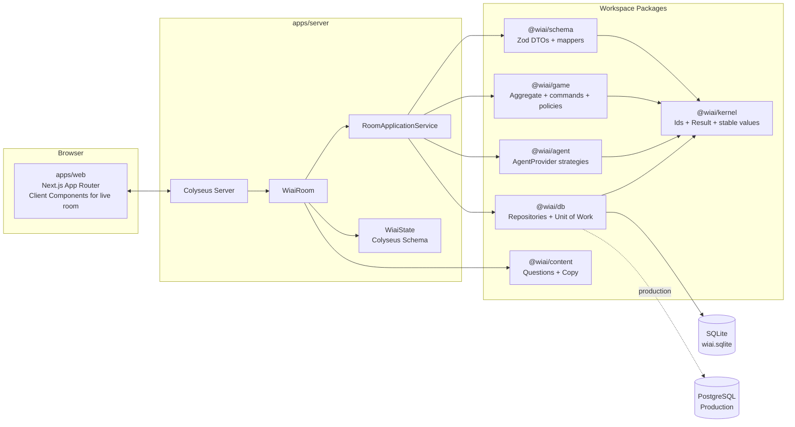
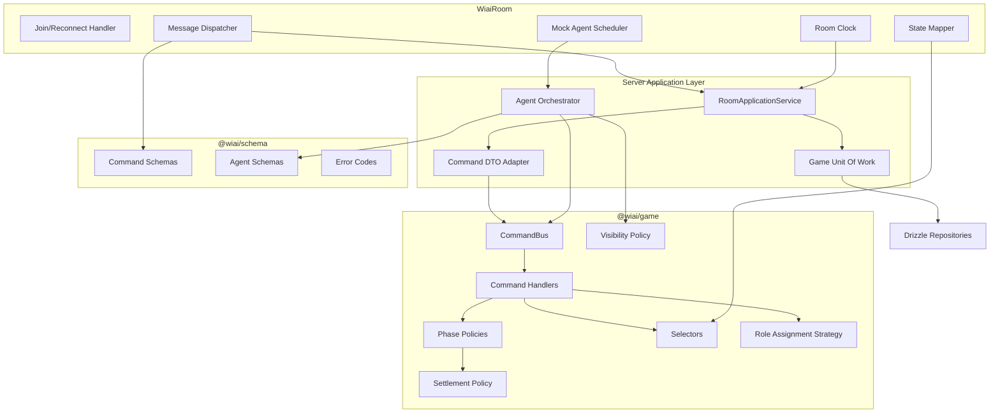
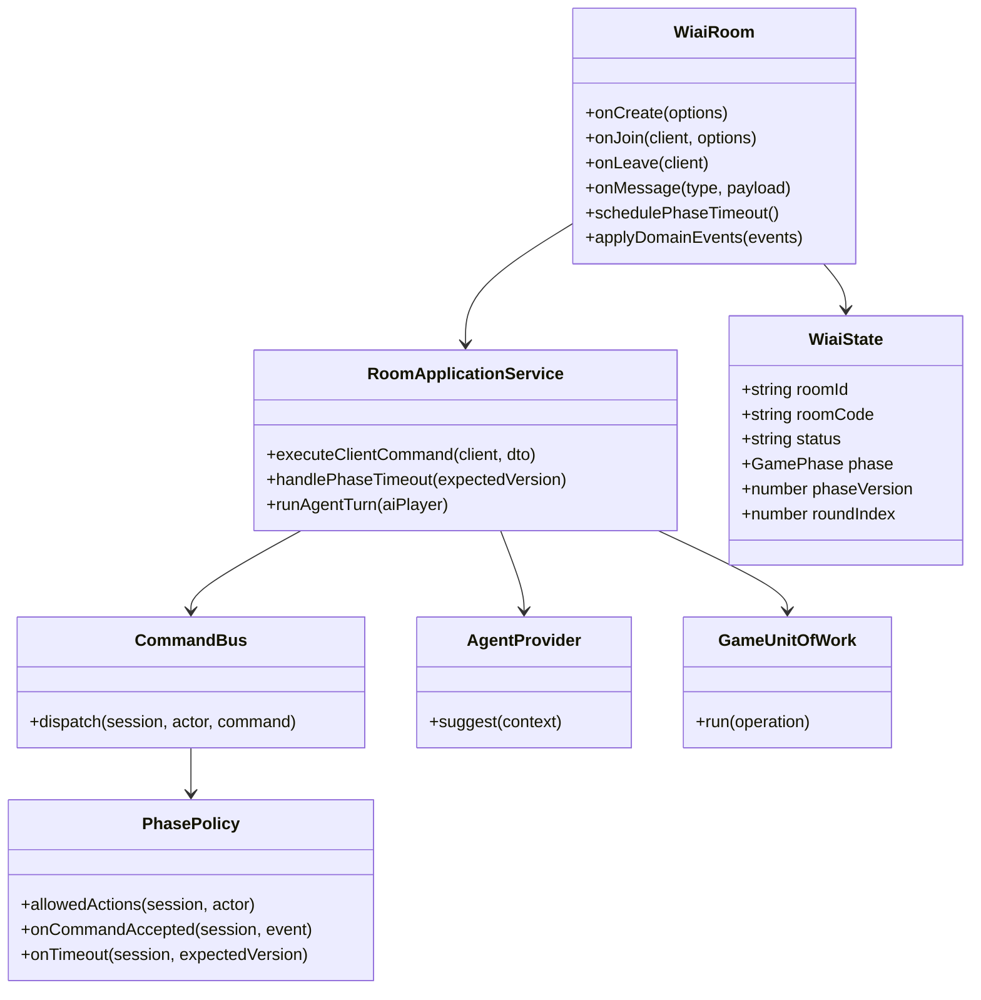

# System UML Diagrams

## Container Diagram

```mermaid
flowchart LR
  subgraph Browser["Browser"]
    Web["apps/web\nNext.js App Router\nClient Components for live room"]
  end

  subgraph GameServer["apps/server"]
    Colyseus["Colyseus Server"]
    Room["WiaiRoom"]
    App["RoomApplicationService"]
    LiveState["WiaiState\nColyseus Schema"]
  end

  subgraph Packages["Workspace Packages"]
    Kernel["@wiai/kernel\nIds + Result + stable values"]
    Schema["@wiai/schema\nZod DTOs + mappers"]
    Game["@wiai/game\nAggregate + commands + policies"]
    Agent["@wiai/agent\nAgentProvider strategies"]
    DB["@wiai/db\nRepositories + Unit of Work"]
    Content["@wiai/content\nQuestions + Copy"]
  end

  SQLite[("SQLite\nwiai.sqlite")]
  Postgres[("PostgreSQL\nProduction")]

  Web <--> Colyseus
  Colyseus --> Room
  Room --> App
  Room --> LiveState
  App --> Schema
  App --> Game
  App --> Agent
  App --> DB
  Room --> Content
  Schema --> Kernel
  Game --> Kernel
  Agent --> Kernel
  DB --> Kernel
  DB --> SQLite
  DB -. production .-> Postgres
```

## Component Diagram

```mermaid
flowchart TB
  subgraph WiaiRoom["WiaiRoom"]
    Join[Join/Reconnect Handler]
    Msg[Message Dispatcher]
    Clock[Room Clock]
    Mapper[State Mapper]
    AgentScheduler[Mock Agent Scheduler]
  end

  subgraph AppLayer["Server Application Layer"]
    AppService[RoomApplicationService]
    CommandAdapter[Command DTO Adapter]
    UnitOfWork[Game Unit Of Work]
    AgentOrchestrator[Agent Orchestrator]
  end

  subgraph GameCore["@wiai/game"]
    CommandBus[CommandBus]
    Handlers[Command Handlers]
    PhasePolicies[Phase Policies]
    Settlement[Settlement Policy]
    Visibility[Visibility Policy]
    Selectors[Selectors]
    Roles[Role Assignment Strategy]
  end

  subgraph Protocol["@wiai/schema"]
    CommandSchemas[Command Schemas]
    AgentSchemas[Agent Schemas]
    ErrorCodes[Error Codes]
  end

  Msg --> CommandSchemas
  Msg --> AppService
  Clock --> AppService
  AgentScheduler --> AgentOrchestrator
  AppService --> CommandAdapter
  CommandAdapter --> CommandBus
  CommandBus --> Handlers
  Handlers --> PhasePolicies
  Handlers --> Selectors
  Handlers --> Roles
  PhasePolicies --> Settlement
  AgentOrchestrator --> AgentSchemas
  AgentOrchestrator --> Visibility
  AgentOrchestrator --> CommandBus
  Mapper --> Selectors
  AppService --> UnitOfWork
  UnitOfWork --> DB[Drizzle Repositories]
```

## Core Class Diagram

```mermaid
classDiagram
  class WiaiRoom {
    +onCreate(options)
    +onJoin(client, options)
    +onLeave(client)
    +onMessage(type, payload)
    +schedulePhaseTimeout()
    +applyDomainEvents(events)
  }

  class RoomApplicationService {
    +executeClientCommand(client, dto)
    +handlePhaseTimeout(expectedVersion)
    +runAgentTurn(aiPlayer)
  }

  class WiaiState {
    +string roomId
    +string roomCode
    +string status
    +GamePhase phase
    +number phaseVersion
    +number roundIndex
  }

  class CommandBus {
    +dispatch(session, actor, command)
  }

  class PhasePolicy {
    +allowedActions(session, actor)
    +onCommandAccepted(session, event)
    +onTimeout(session, expectedVersion)
  }

  class AgentProvider {
    +suggest(context)
  }

  class GameUnitOfWork {
    +run(operation)
  }

  WiaiRoom --> WiaiState
  WiaiRoom --> RoomApplicationService
  RoomApplicationService --> CommandBus
  RoomApplicationService --> AgentProvider
  RoomApplicationService --> GameUnitOfWork
  CommandBus --> PhasePolicy
```
