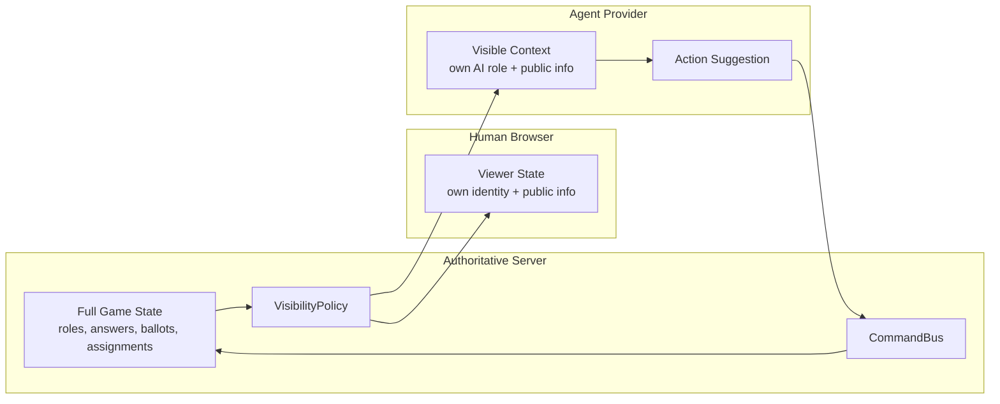
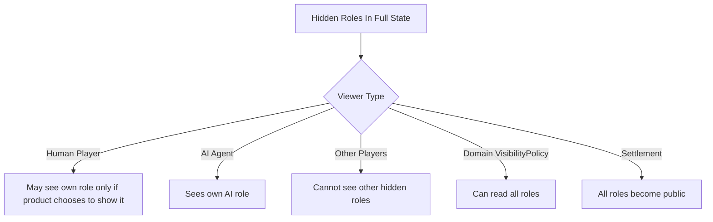
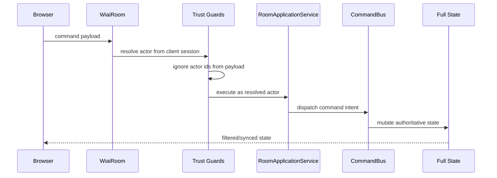

# Visibility And Trust Diagrams

## Hidden Information Boundary

```mermaid
flowchart LR
  subgraph Server["Authoritative Server"]
    FullState["Full Game State\nroles, answers, ballots, assignments"]
    Visibility["VisibilityPolicy"]
    CommandBus["CommandBus"]
  end

  subgraph HumanClient["Human Browser"]
    HumanView["Viewer State\nown identity + public info"]
  end

  subgraph AgentProvider["Agent Provider"]
    AgentContext["Visible Context\nown AI role + public info"]
    Suggestion["Action Suggestion"]
  end

  FullState --> Visibility
  Visibility --> HumanView
  Visibility --> AgentContext
  AgentContext --> Suggestion
  Suggestion --> CommandBus
  CommandBus --> FullState
```

## Pre-Settlement Visibility Matrix

```mermaid
flowchart TD
  FullRoles[Hidden Roles In Full State] --> Check{Viewer Type}
  Check -->|Human Player| OwnHuman[May see own role only if product chooses to show it]
  Check -->|AI Agent| OwnAI[Sees own AI role]
  Check -->|Other Players| NoOtherRoles[Cannot see other hidden roles]
  Check -->|Domain VisibilityPolicy| AllRoles[Can read all roles]
  Check -->|Settlement| RevealAll[All roles become public]
```

## Trust Boundary

```mermaid
sequenceDiagram
  participant Browser
  participant Room as WiaiRoom
  participant Guard as Trust Guards
  participant App as RoomApplicationService
  participant Bus as CommandBus
  participant State as Full State

  Browser->>Room: command payload
  Room->>Guard: resolve actor from client session
  Guard->>Guard: ignore actor ids from payload
  Guard->>App: execute as resolved actor
  App->>Bus: dispatch command intent
  Bus->>State: mutate authoritative state
  State-->>Browser: filtered/synced state
```
