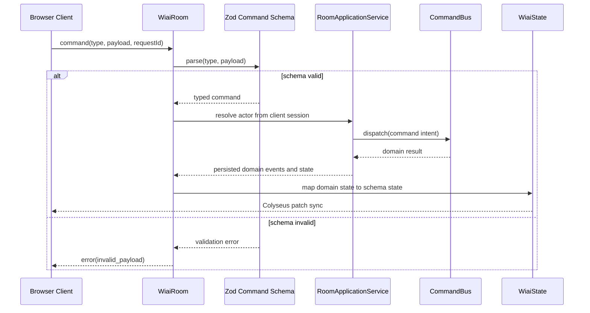
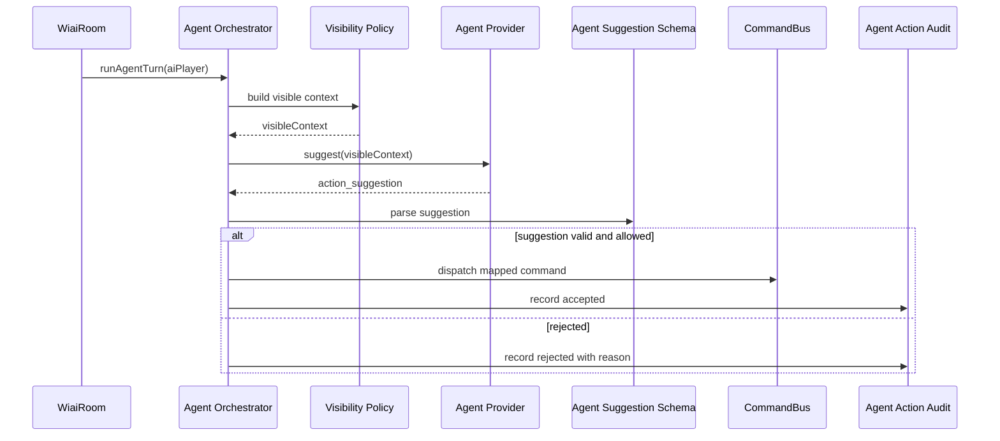
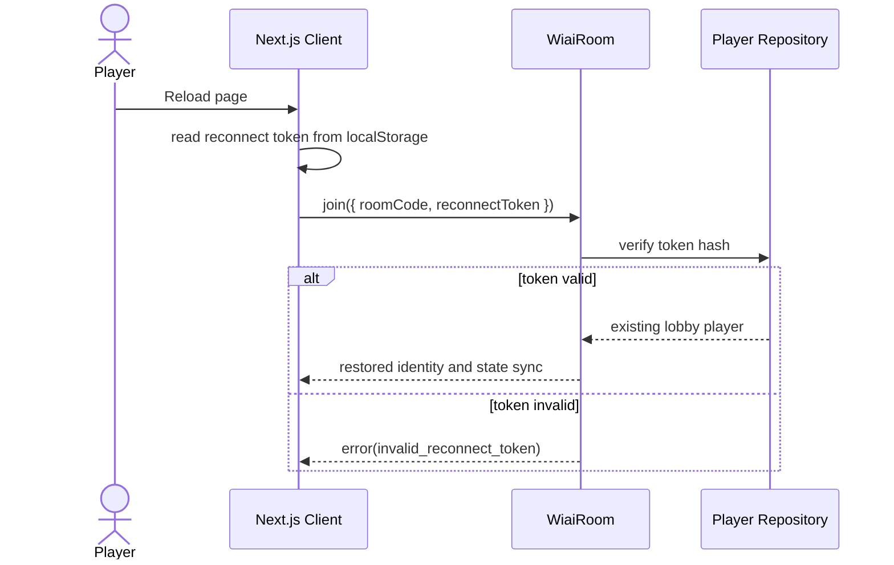

# Protocol Sequence Diagrams

## Browser Command Protocol

```mermaid
sequenceDiagram
  participant Client as Browser Client
  participant Room as WiaiRoom
  participant Zod as Zod Command Schema
  participant App as RoomApplicationService
  participant Command as CommandBus
  participant State as WiaiState

  Client->>Room: command(type, payload, requestId)
  Room->>Zod: parse(type, payload)
  alt schema valid
    Zod-->>Room: typed command
    Room->>App: resolve actor from client session
    App->>Command: dispatch(command intent)
    Command-->>App: domain result
    App-->>Room: persisted domain events and state
    Room->>State: map domain state to schema state
    State-->>Client: Colyseus patch sync
  else schema invalid
    Zod-->>Room: validation error
    Room-->>Client: error(invalid_payload)
  end
```

## Agent Suggestion Protocol

```mermaid
sequenceDiagram
  participant Room as WiaiRoom
  participant App as Agent Orchestrator
  participant Context as Visibility Policy
  participant Agent as Agent Provider
  participant Zod as Agent Suggestion Schema
  participant Command as CommandBus
  participant Audit as Agent Action Audit

  Room->>App: runAgentTurn(aiPlayer)
  App->>Context: build visible context
  Context-->>App: visibleContext
  App->>Agent: suggest(visibleContext)
  Agent-->>App: action_suggestion
  App->>Zod: parse suggestion
  alt suggestion valid and allowed
    App->>Command: dispatch mapped command
    App->>Audit: record accepted
  else rejected
    App->>Audit: record rejected with reason
  end
```

## Reconnect Protocol

```mermaid
sequenceDiagram
  actor Player
  participant Web as Next.js Client
  participant Room as WiaiRoom
  participant DB as Player Repository

  Player->>Web: Reload page
  Web->>Web: read reconnect token from localStorage
  Web->>Room: join({ roomCode, reconnectToken })
  Room->>DB: verify token hash
  alt token valid
    DB-->>Room: existing lobby player
    Room-->>Web: restored identity and state sync
  else token invalid
    Room-->>Web: error(invalid_reconnect_token)
  end
```
