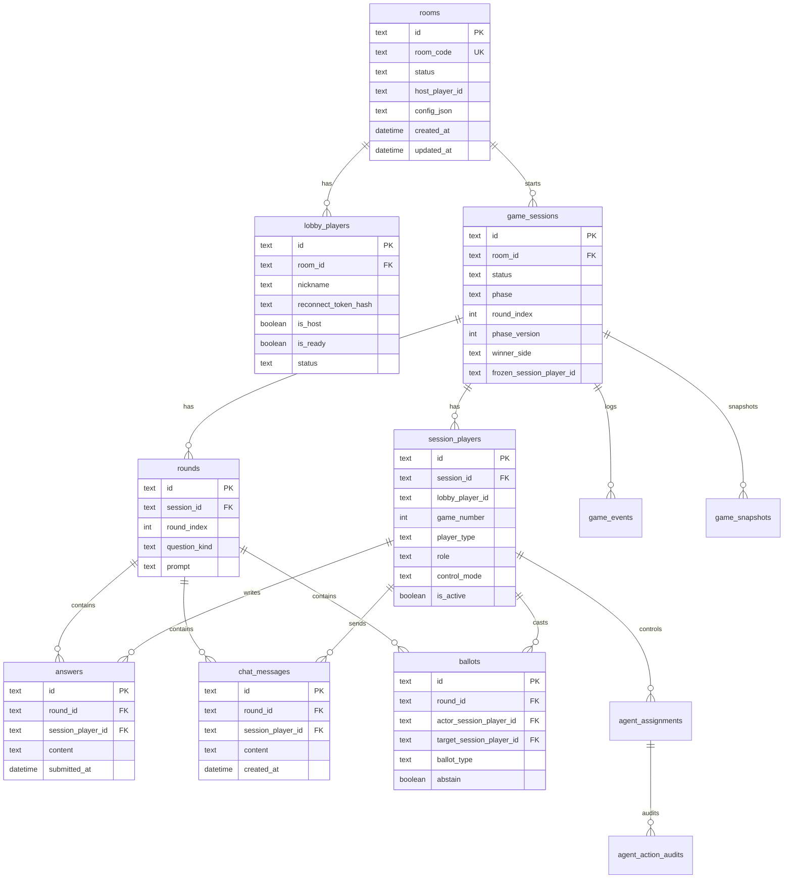
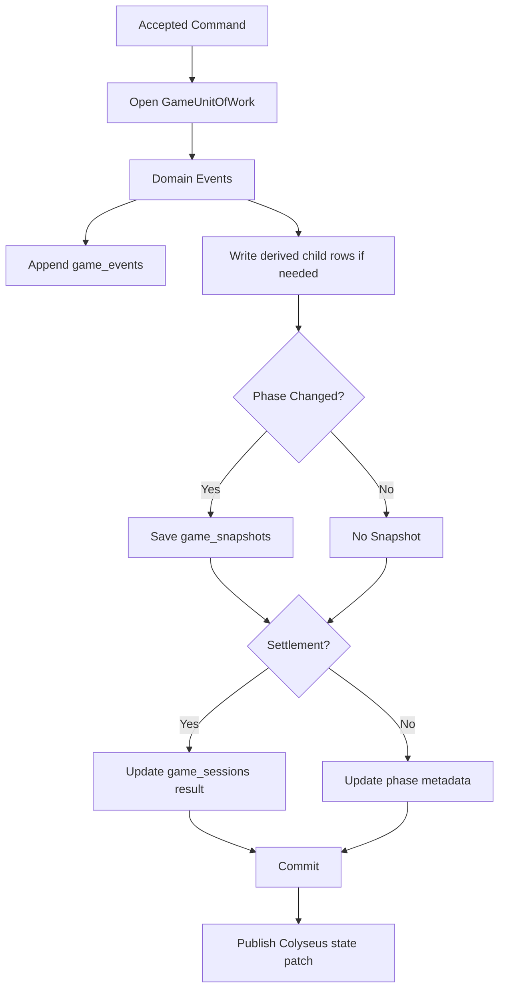

# Database Diagrams

## Detailed ERD

```mermaid
erDiagram
  rooms ||--o{ lobby_players : has
  rooms ||--o{ game_sessions : starts
  game_sessions ||--o{ session_players : has
  game_sessions ||--o{ rounds : has
  game_sessions ||--o{ game_events : logs
  game_sessions ||--o{ game_snapshots : snapshots
  rounds ||--o{ answers : contains
  rounds ||--o{ chat_messages : contains
  rounds ||--o{ ballots : contains
  session_players ||--o{ answers : writes
  session_players ||--o{ chat_messages : sends
  session_players ||--o{ ballots : casts
  session_players ||--o{ agent_assignments : controls
  agent_assignments ||--o{ agent_action_audits : audits

  rooms {
    text id PK
    text room_code UK
    text status
    text host_player_id
    text config_json
    datetime created_at
    datetime updated_at
  }

  lobby_players {
    text id PK
    text room_id FK
    text nickname
    text reconnect_token_hash
    boolean is_host
    boolean is_ready
    text status
  }

  game_sessions {
    text id PK
    text room_id FK
    text status
    text phase
    int round_index
    int phase_version
    text winner_side
    text frozen_session_player_id
  }

  session_players {
    text id PK
    text session_id FK
    text lobby_player_id
    int game_number
    text player_type
    text role
    text control_mode
    boolean is_active
  }

  rounds {
    text id PK
    text session_id FK
    int round_index
    text question_kind
    text prompt
  }

  answers {
    text id PK
    text round_id FK
    text session_player_id FK
    text content
    datetime submitted_at
  }

  chat_messages {
    text id PK
    text round_id FK
    text session_player_id FK
    text content
    datetime created_at
  }

  ballots {
    text id PK
    text round_id FK
    text actor_session_player_id FK
    text target_session_player_id FK
    text ballot_type
    boolean abstain
  }
```

## Persistence Flow

```mermaid
flowchart TD
  A[Accepted Command] --> U[Open GameUnitOfWork]
  U --> B[Domain Events]
  B --> C[Append game_events]
  B --> D[Write derived child rows if needed]
  D --> E{Phase Changed?}
  E -->|Yes| F[Save game_snapshots]
  E -->|No| G[No Snapshot]
  F --> H{Settlement?}
  G --> H
  H -->|Yes| I[Update game_sessions result]
  H -->|No| J[Update phase metadata]
  I --> K[Commit]
  J --> K
  K --> L[Publish Colyseus state patch]
```
