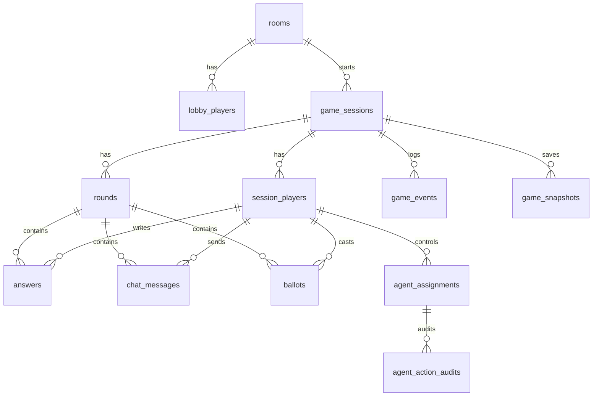

# Database ERD

## Persistence Philosophy

- Live game state is in Colyseus while room is active.
- Database stores durable audit and recovery data.
- Events are append-only.
- Snapshots are plain JSON.
- Final result is stored on `game_sessions`.

