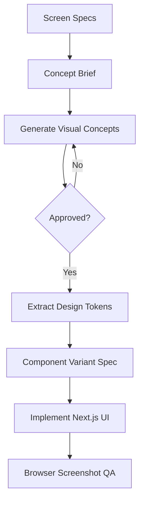

# Visual Design Concept Brief

This document is a required bridge between the engineering handbook and frontend implementation.

## Why This Exists

The current handbook defines screen structure and UX requirements, but it is not yet a visual design spec. Before implementing the Next.js UI, create and approve visual concepts for the core game screens.

## Required Concept Screens

Create concepts for:

1. Create/join screen.
2. Lobby screen.
3. Live game screen during `answer_prep`.
4. Live game screen during `discussion`.
5. Voting panel.
6. Settlement reveal.
7. Mobile live game layout.

## Concept Requirements

- Must look like a real playable app, not a marketing landing page.
- Must use a restrained shadcn/Vercel-style interface.
- Must keep phase, timer, current question, and primary action visually dominant.
- Must define desktop and mobile layout behavior.
- Must show disabled and active states for core controls.
- Must avoid nested cards and decorative clutter.
- Must include a typography and spacing system.

## Implementation Inventory To Extract

After concept approval, document:

- Color tokens.
- Typography scale.
- Radius and border treatment.
- Button variants.
- Input and textarea states.
- Roster item states.
- Message bubble style.
- Vote option style.
- Settlement reveal hierarchy.
- Motion moments and timing.

## Mermaid Planning View

