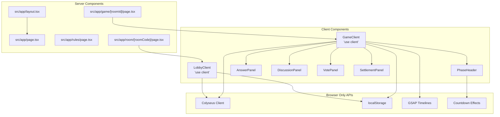
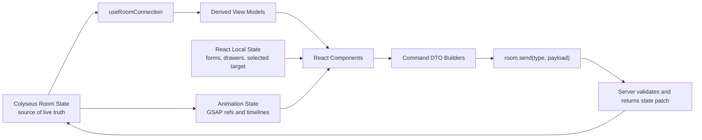
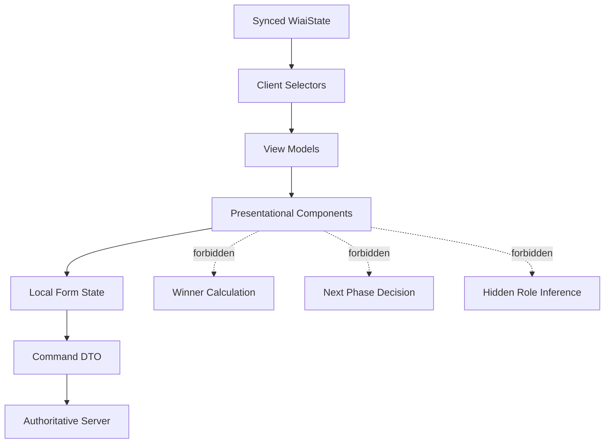
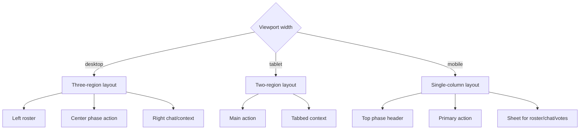
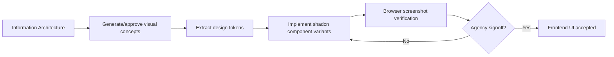

# Frontend Architecture Diagrams

## Next.js Server And Client Component Boundary

## Frontend State Ownership

## Presenter And Rule Boundary

## Responsive Layout Decision Tree

## Visual Design Gate

