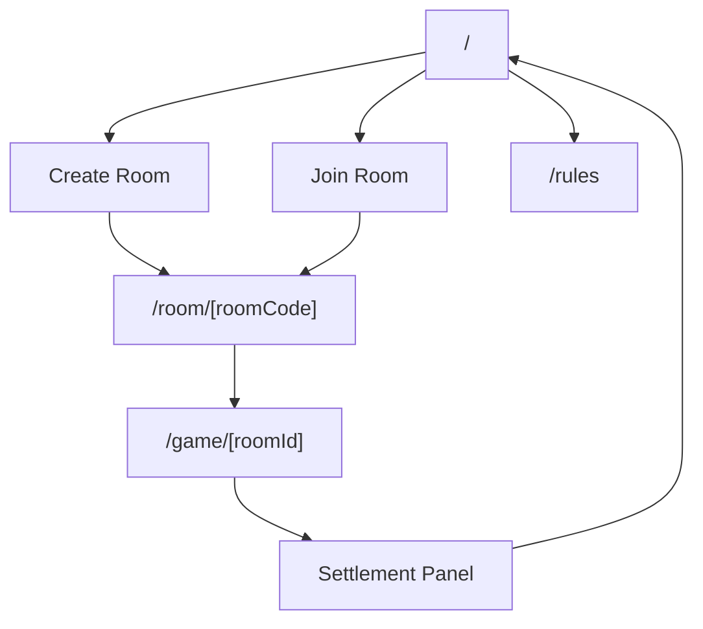
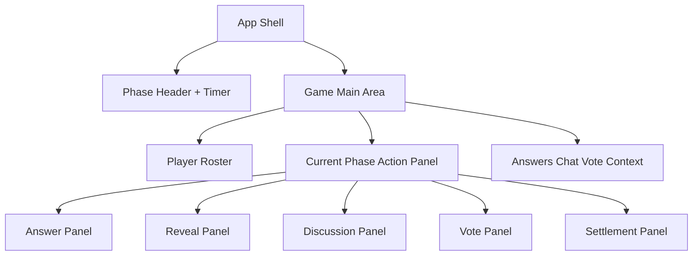
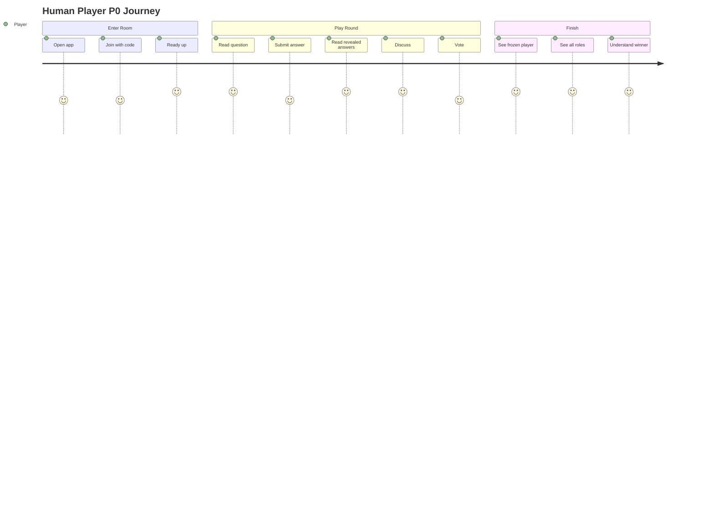

# UI Flow Diagrams

## Route Flow

```mermaid
flowchart TD
  Home["/"] --> Create[Create Room]
  Home --> Join[Join Room]
  Create --> Lobby["/room/[roomCode]"]
  Join --> Lobby
  Lobby --> Game["/game/[roomId]"]
  Game --> Settlement[Settlement Panel]
  Home --> Rules["/rules"]
  Settlement --> Home
```

## Live Game Screen Composition

```mermaid
flowchart TB
  Shell[App Shell] --> Header[Phase Header + Timer]
  Shell --> Main[Game Main Area]
  Main --> Roster[Player Roster]
  Main --> Action[Current Phase Action Panel]
  Main --> Context[Answers Chat Vote Context]

  Action --> AnswerPanel[Answer Panel]
  Action --> RevealPanel[Reveal Panel]
  Action --> DiscussionPanel[Discussion Panel]
  Action --> VotePanel[Vote Panel]
  Action --> SettlementPanel[Settlement Panel]
```

## User Journey

```mermaid
journey
  title Human Player P0 Journey
  section Enter Room
    Open app: 4: Player
    Join with code: 4: Player
    Ready up: 5: Player
  section Play Round
    Read question: 5: Player
    Submit answer: 4: Player
    Read revealed answers: 5: Player
    Discuss: 5: Player
    Vote: 4: Player
  section Finish
    See frozen player: 5: Player
    See all roles: 5: Player
    Understand winner: 5: Player
```

