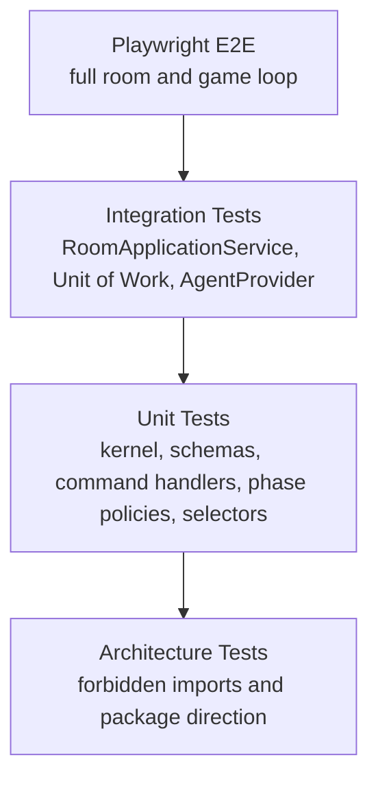
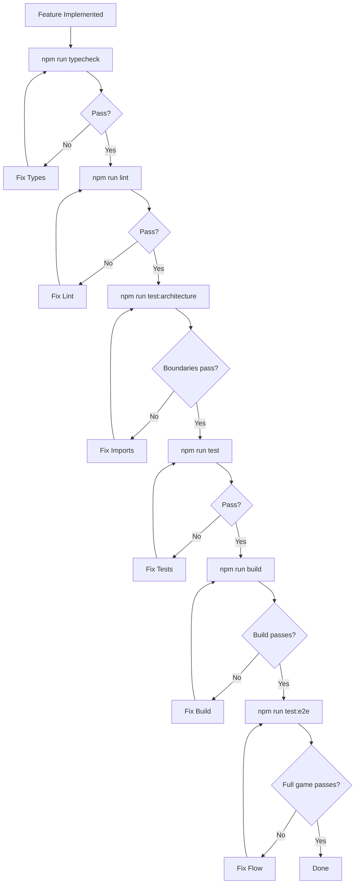
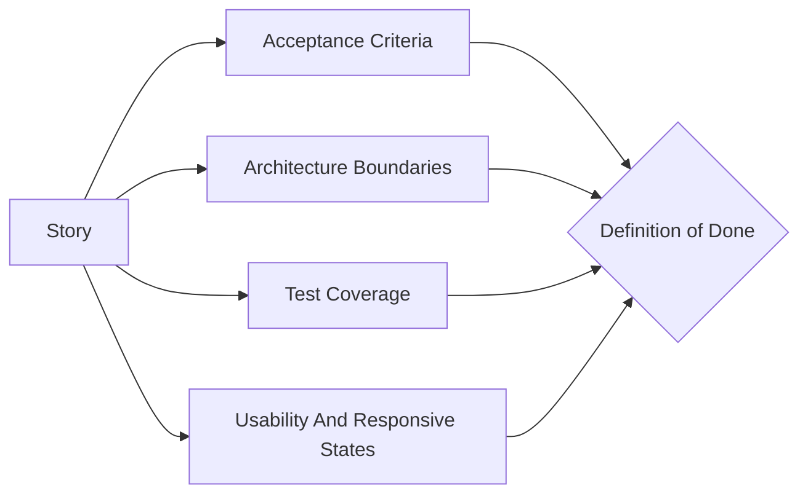

# Quality Gate Diagrams

## Test Pyramid

```mermaid
flowchart TB
  E2E["Playwright E2E\nfull room and game loop"]
  Integration["Integration Tests\nRoomApplicationService, Unit of Work, AgentProvider"]
  Unit["Unit Tests\nkernel, schemas, command handlers, phase policies, selectors"]
  Architecture["Architecture Tests\nforbidden imports and package direction"]

  E2E --> Integration
  Integration --> Unit
  Unit --> Architecture
```

## P0 Completion Gate

```mermaid
flowchart TD
  A[Feature Implemented] --> B[npm run typecheck]
  B --> C{Pass?}
  C -->|No| Fix1[Fix Types]
  Fix1 --> B
  C -->|Yes| D[npm run lint]
  D --> E{Pass?}
  E -->|No| Fix2[Fix Lint]
  Fix2 --> D
  E -->|Yes| F[npm run test:architecture]
  F --> G{Boundaries pass?}
  G -->|No| Fix3[Fix Imports]
  Fix3 --> F
  G -->|Yes| H[npm run test]
  H --> I{Pass?}
  I -->|No| Fix4[Fix Tests]
  Fix4 --> H
  I -->|Yes| J[npm run build]
  J --> K{Build passes?}
  K -->|No| Fix5[Fix Build]
  Fix5 --> J
  K -->|Yes| L[npm run test:e2e]
  L --> M{Full game passes?}
  M -->|No| Fix6[Fix Flow]
  Fix6 --> L
  M -->|Yes| Done[Done]
```

## Review Responsibility Matrix

```mermaid
flowchart LR
  Story[Story] --> Product[Acceptance Criteria]
  Story --> Engineering[Architecture Boundaries]
  Story --> QA[Test Coverage]
  Story --> UX[Usability And Responsive States]

  Product --> Done{Definition of Done}
  Engineering --> Done
  QA --> Done
  UX --> Done
```
