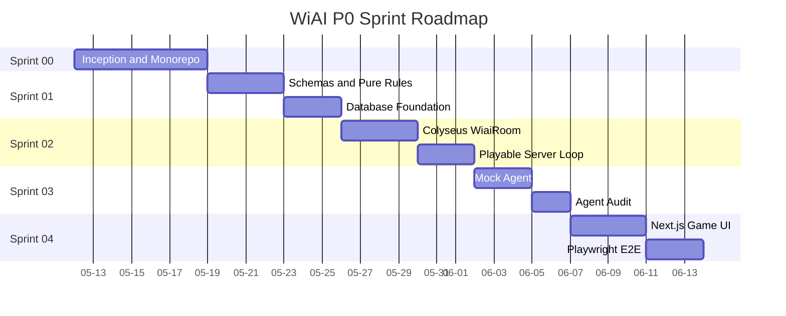
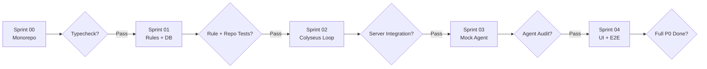

# Sprint Roadmap Diagrams

## Sprint Roadmap

```mermaid
gantt
  title WiAI P0 Sprint Roadmap
  dateFormat  YYYY-MM-DD
  axisFormat  %m-%d

  section Sprint 00
  Inception and Monorepo      :s00, 2026-05-12, 7d

  section Sprint 01
  Schemas and Pure Rules      :s01a, after s00, 4d
  Database Foundation         :s01b, after s01a, 3d

  section Sprint 02
  Colyseus WiaiRoom           :s02a, after s01b, 4d
  Playable Server Loop        :s02b, after s02a, 3d

  section Sprint 03
  Mock Agent                  :s03a, after s02b, 3d
  Agent Audit                 :s03b, after s03a, 2d

  section Sprint 04
  Next.js Game UI             :s04a, after s03b, 4d
  Playwright E2E              :s04b, after s04a, 3d
```

## Sprint Gate Flow

```mermaid
flowchart LR
  S00[Sprint 00\nMonorepo] --> G00{Typecheck?}
  G00 -->|Pass| S01[Sprint 01\nRules + DB]
  S01 --> G01{Rule + Repo Tests?}
  G01 -->|Pass| S02[Sprint 02\nColyseus Loop]
  S02 --> G02{Server Integration?}
  G02 -->|Pass| S03[Sprint 03\nMock Agent]
  S03 --> G03{Agent Audit?}
  G03 -->|Pass| S04[Sprint 04\nUI + E2E]
  S04 --> G04{Full P0 Done?}
```

