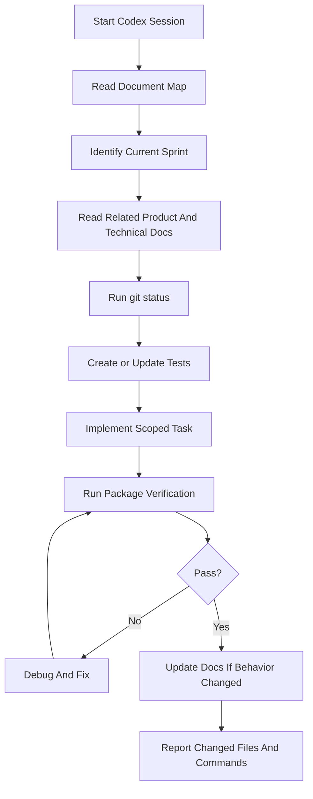
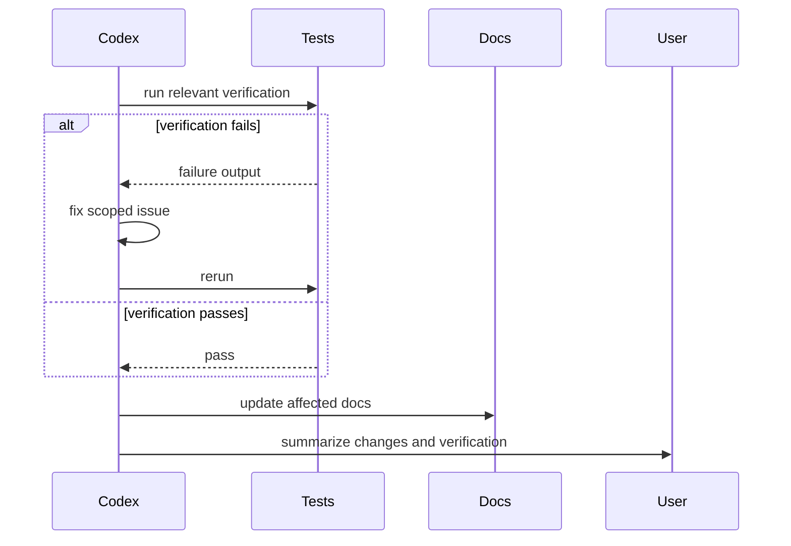

# Codex Workflow Diagrams

## Implementation Session Flow

```mermaid
flowchart TD
  A[Start Codex Session] --> B[Read Document Map]
  B --> C[Identify Current Sprint]
  C --> D[Read Related Product And Technical Docs]
  D --> E[Run git status]
  E --> F[Create or Update Tests]
  F --> G[Implement Scoped Task]
  G --> H[Run Package Verification]
  H --> I{Pass?}
  I -->|No| J[Debug And Fix]
  J --> H
  I -->|Yes| K[Update Docs If Behavior Changed]
  K --> L[Report Changed Files And Commands]
```

## Review Sequence

```mermaid
sequenceDiagram
  participant Codex
  participant Tests
  participant Docs
  participant User

  Codex->>Tests: run relevant verification
  alt verification fails
    Tests-->>Codex: failure output
    Codex->>Codex: fix scoped issue
    Codex->>Tests: rerun
  else verification passes
    Tests-->>Codex: pass
  end
  Codex->>Docs: update affected docs
  Codex->>User: summarize changes and verification
```

